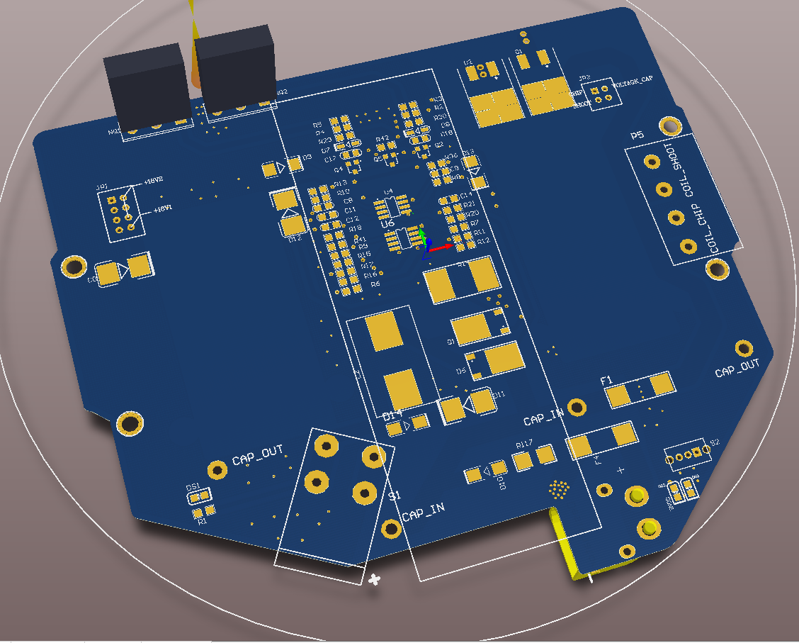
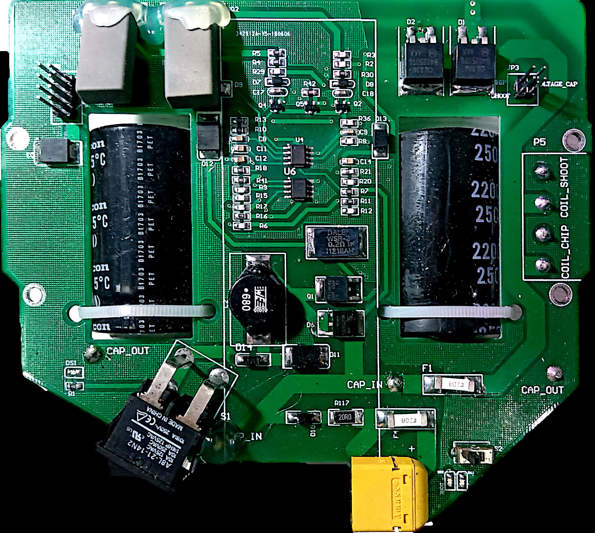

# ZJUNlict Booster Board Description

The booster board is used to charge capacitors and discharge via shoot and chip coils. The 2D and 3D design view are shown below. 

The main features are:

* Current-mode PWM controller UC3843 acts as a booster converter to charge two capacitors (each with 2200 uF capacitance and voltage rating at 250V) to 225V (Adjustable by simply modifying the voltage feedback resistor pair).
* Two MOSFETs (IPP200N25N) control the discharge duration of the cpacitors.
* A voltage comparator is used to show if the capacitors are charged through an LED to avoid accidental electric shock.
* Limiting voltage and current to the main borad.

The photos of the booster board are shown below as references. 

